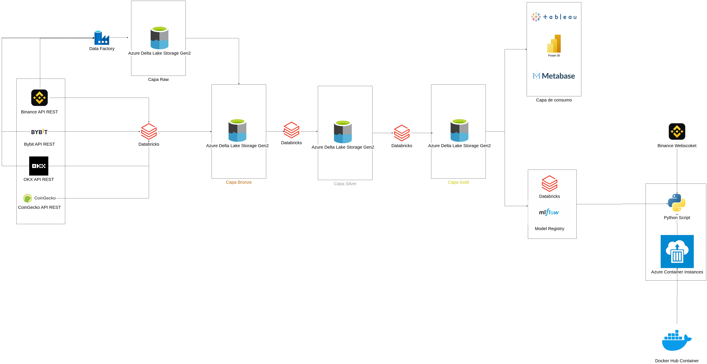
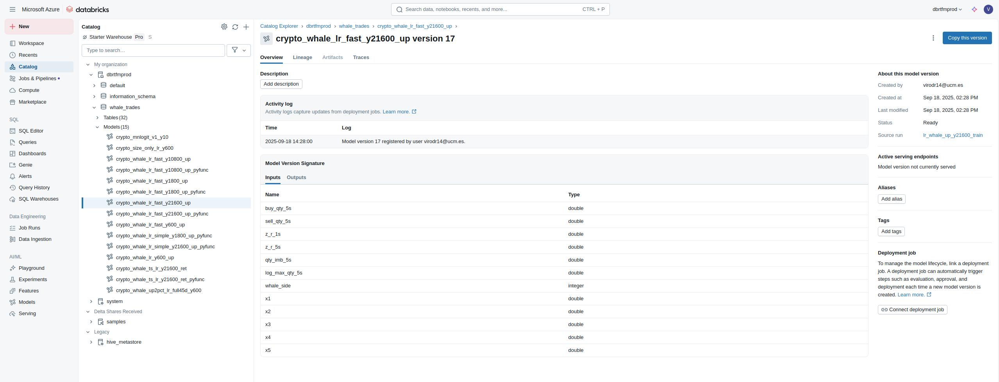
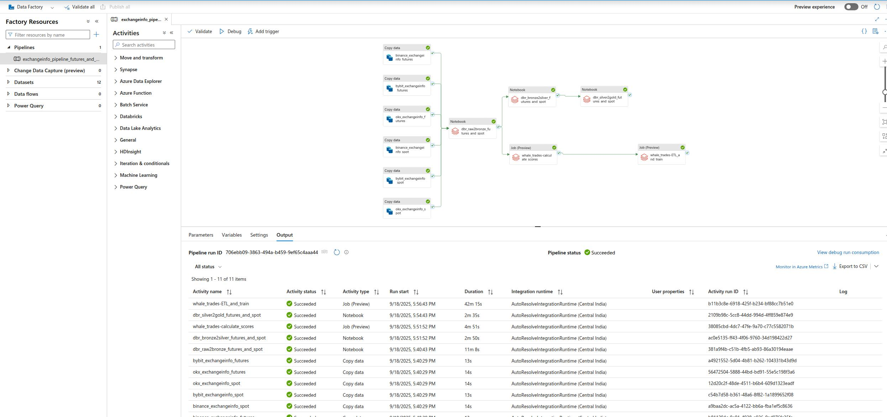
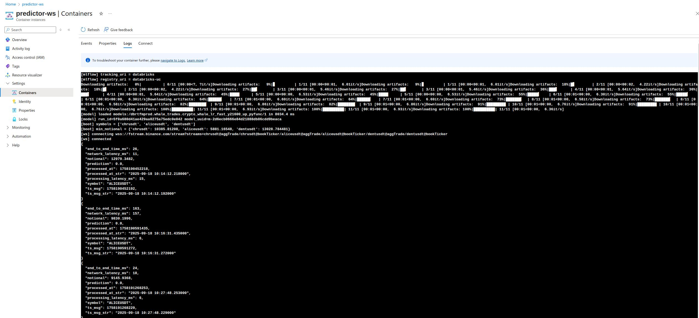

# Arquitectura de Análisis y Trading Predictivo en Mercados de Futuros de Criptomonedas

## Resumen
Este proyecto implementa un **pipeline de datos de extremo a extremo en Microsoft Azure** para analizar la variabilidad del precio en mercados de futuros de criptomonedas y **detectar “whale trades”** (operaciones de gran volumen) y predecir subidas en la cotización.  

- Procesa y transforma la información en **Azure Databricks** desde **Binance API, OKX API y Bybit API.**
- Aplica arquitectura **Medallion (raw, bronze, silver, gold)** para almacenamiento en **Azure Data Lake Storage Gen2**.  
- Entrena y registra modelos en **MLflow**, integrados con **Unity Catalog**.  
- Despliega un prototipo en **Azure Container Instances (ACI)** que consume el WebSocket de Binance y realiza predicciones en tiempo real.  

## Arquitectura
  

## Componentes principales:
- **Fuentes de datos**: Binance (REST/WebSocket), Bybit y OKX. 
- **Almacenamiento**: ADLS Gen2 con arquitectura Medallion (raw → bronze → silver → gold). 
- **Ingesta/Orquestación**: Azure Data Factory + Azure Databricks
- **Procesamiento**: Azure Databricks
- **Gobierno**: Unity Catalog para trazabilidad y control de accesos.  
- **Modelado**: MLflow para experimentos, métricas y registro de modelos.  
- **Despliegue**: Docker + Azure Container Instances (ACI).  
  

## Resultados clave:  
  - **Reducción de latencia:** 59% desplegando en región Japan East.  
  - **Coste de producción optimizado:** 0,89 €/día en ACI.
  - **Tiempo medio de predicción**: 6 ms.
  - **Retorno medio por señal**: +0,81%.
  - **Mediana de retorno (p50)**: +0,93%.  
  - **Operaciones ganadoras (>0)**: 73,2%.  
  - **Señales ≥ 1%**: 49,48%.  
  - **Precisión positiva**: 49,48%.  

## Cómo Ejecutar
1. **Ingesta y entrenamiento**: ejecutar pipeline de Data Factory.
  
2. **Despliegue**: modificar url del modelo del .env y lanzar el contenedoren Azure Container Instances
  

## 🔮 Futuras Mejoras
- Integrar el despliegue en ACI en el pipeline de Azure Data Factory
- Generar paquete `.whl` para reutilizar el pipeline.  
- Implementar borrado/archivado automático de datos antiguos.  
- Desarrollar paneles en Power BI o notebooks para reporting avanzado.  

Máster en Big Data & Data Engineering (UCM)  
**Autor:** Víctor Daniel Rodríguez  

